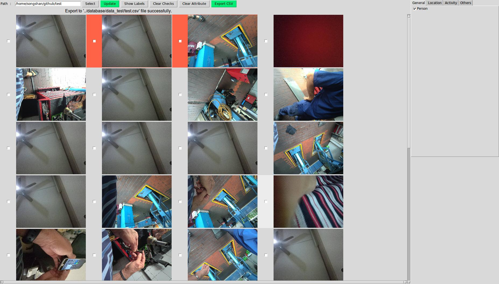

Manual Image Labeling Software for a social science research project at Lee Kuan Yew Centre for Innovative Cities (LKYCIC)

**Image Labeling Software**: [imageLabelingSoftware.py](application/imageLabelingSoftware.py)

### Instruction

1. Download zip file from https://github.com/songshan0321/Image-Labeling-Software.git and unzip it.

  **Attention:** Please do not edit any file's directory and code in this folder. Make sure lkydata.db is inside database folder.

  *If python2.7 is not installed in your computer, Download and install Python2.7.14 from https://www.python.org/downloads/ .*

2. Open IDLE (Python GUI). Then, open imageLabelingSoftware.py.

  

  

  3. Run program (Press F5). Now you will be able to see the software GUI.

  

  *For windows user, if you get this error, “ImportError: DLL load failed: The specified procedure could not be found.” , can run “Pillow-4.0.0.win32-py2.7.exe” in this repo.*

3. After finish labeling work, click 'Export CSV' button, 'output_xxx.csv' file will be generated in ['output' folder](output).

  *P/S: Multiple CSV files will be created if you pressed button multiple times*

  

  *If you want visualize database, can proceed to Step 5 .*

4. (Optional) Download and install SQLitestudio. https://sqlitestudio.pl/index.rvt?act=download. Then, open SQLitestudio click Databse > Add a database, press the ‘+’ button to add [‘lkydat.db’](database/lkydata.db) and connect it to the database. At the left column, click Tables > attributes. You will be able to see the data here. Press F5 to refresh once you update the database.